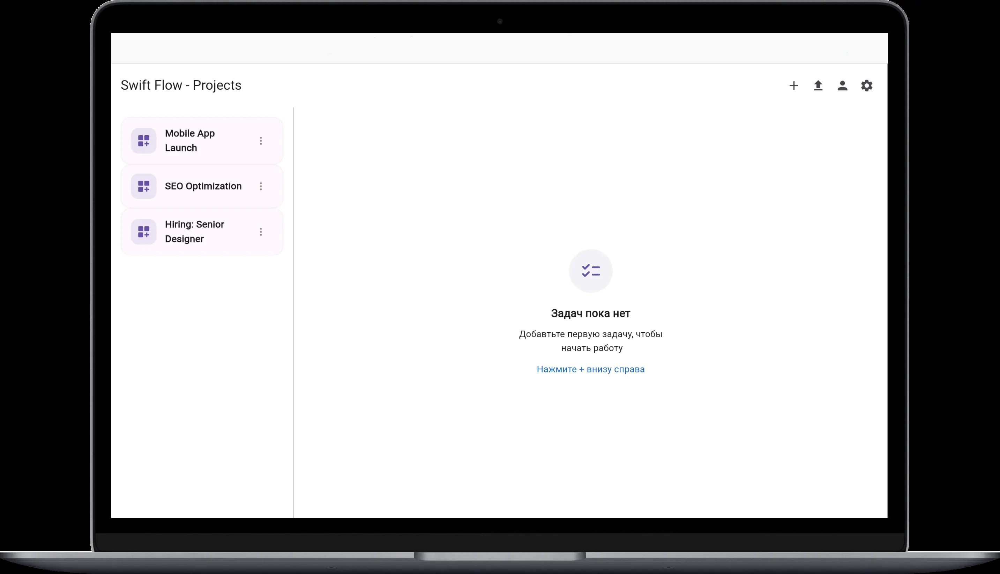
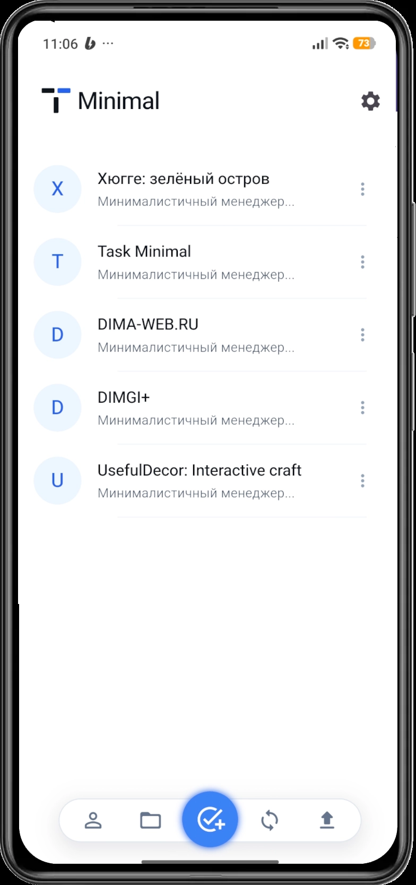

# Task Minimal — Open-Source Minimalist Task & Project Manager (Flutter)

Task Minimal is an **open-source task and project management app** built with **Flutter**.  
It is designed for developers and professionals who need a **fast, distraction-free productivity tool** without the complexity of traditional project management software.

The app focuses on **clarity, speed, and low cognitive load**, making it suitable for managing everything from simple daily tasks to large, structured projects.

> ⚠️ **Status:** Early Alpha — active development

---

## What Is Task Minimal?

Task Minimal is a **minimalist task manager and project management application** that removes unnecessary features commonly found in tools like Notion, Jira, or Trello.

Instead of complex configuration and overloaded interfaces, Task Minimal provides:
- clear task structures
- smooth navigation
- a focused workflow that helps users finish work, not manage software

---

## Who Is Task Minimal For?

Task Minimal is designed for:

- **Developers** who want a lightweight task manager
- **Freelancers** managing multiple projects without heavy PM tools
- **Productivity-focused users** overwhelmed by feature-heavy apps
- **Small teams or solo professionals** who value simplicity and speed

---

## Key Features

- **Minimalist Interface**  
  Clean UI with no visual clutter or redundant controls

- **Project Scalability**  
  Suitable for both small task lists and complex multi-level projects

- **Fast & Responsive UX**  
  Optimized for smooth interactions and low latency

- **Cross-Platform Support**  
  Single Flutter codebase for multiple platforms

- **Focus-Oriented Workflow**  
  Designed to reduce cognitive overload and decision fatigue

---

## Philosophy

Most productivity and project management apps suffer from one of two problems:
1. They are too simple to scale
2. They become bloated and hard to use

Task Minimal follows a different approach:
> **Fewer features, better execution.**

Every part of the interface exists to support task completion, not configuration.

---

## Technology Stack

Task Minimal is developed as an **open-source Flutter application**, using:

- **Dart**
- **Flutter Framework**
- Reactive UI principles
- Performance-oriented architecture

This allows:
- high performance (60/120 FPS where supported)
- true cross-platform development
- native-like user experience

---


# Minimalist Task Manager

<p align="center">
  
  &nbsp;&nbsp;&nbsp;&nbsp;
  
</p>

---


## Getting Started

```bash
git clone https://github.com/Dima011099/Task Minimal-app.git
cd Task Minimal-app
flutter pub get
flutter run
